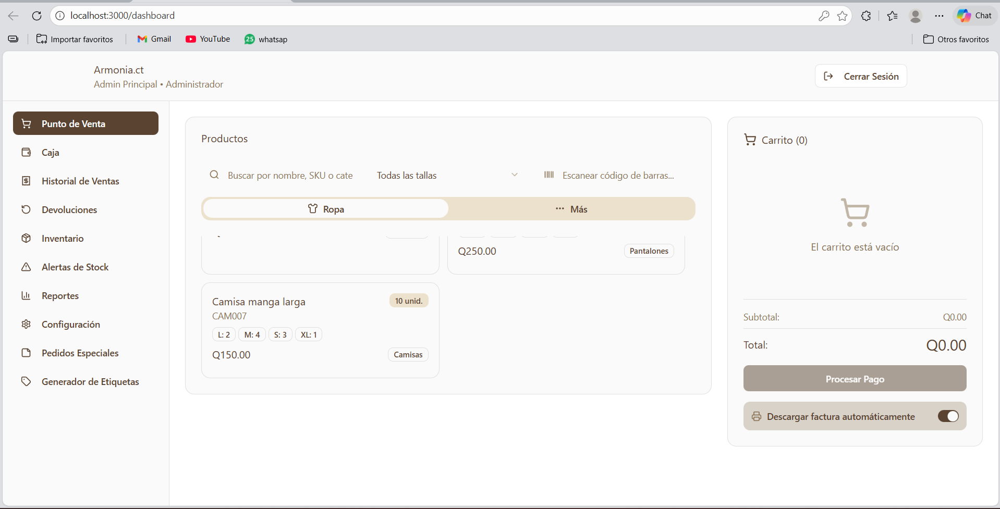
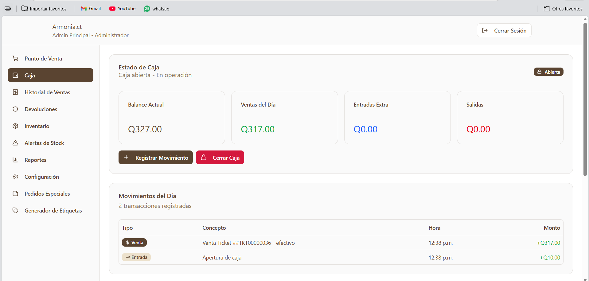
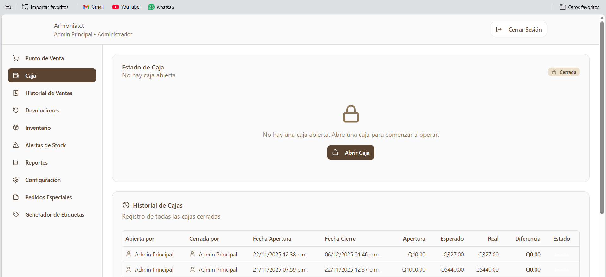
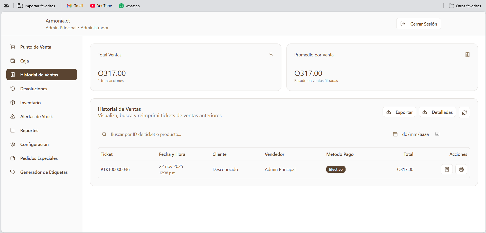
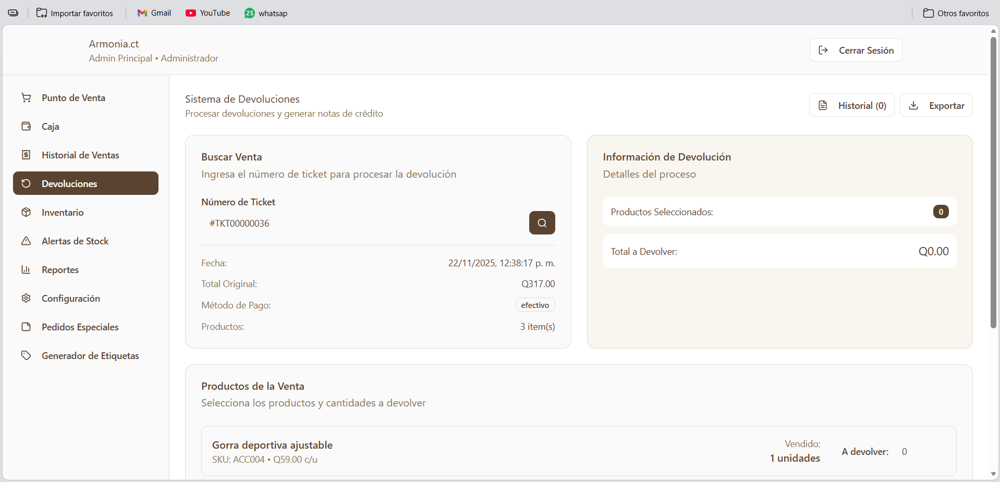
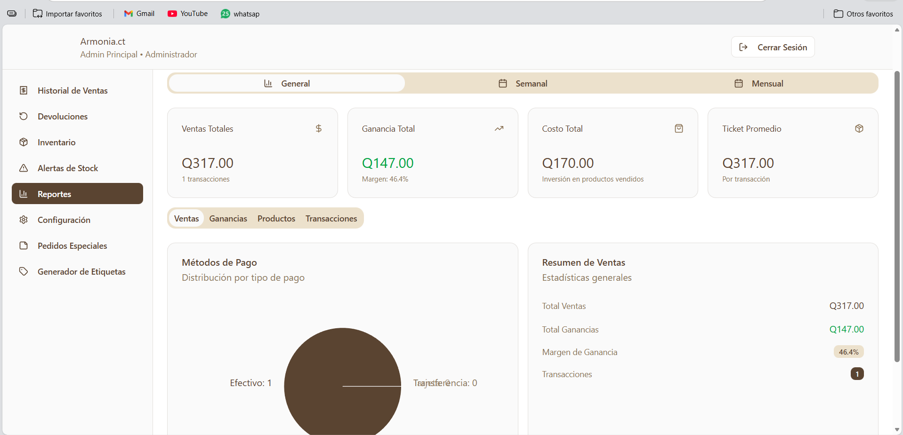
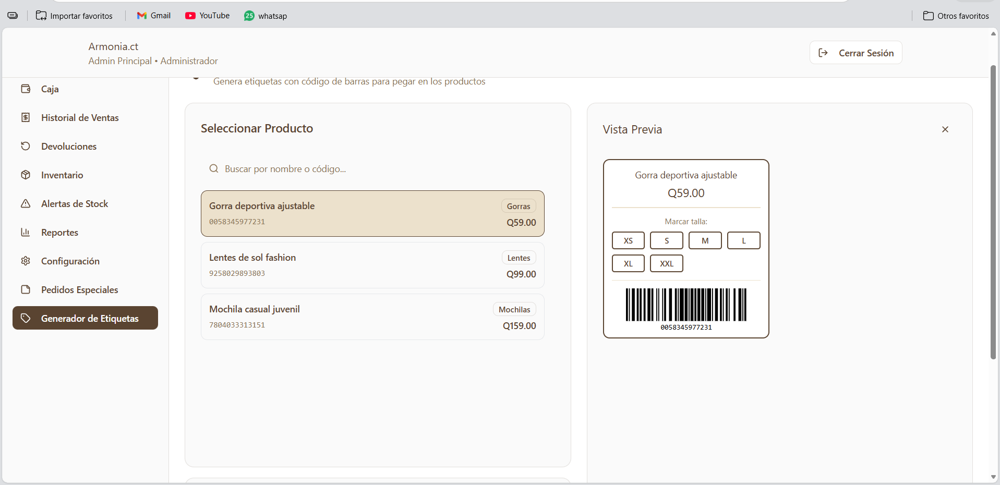
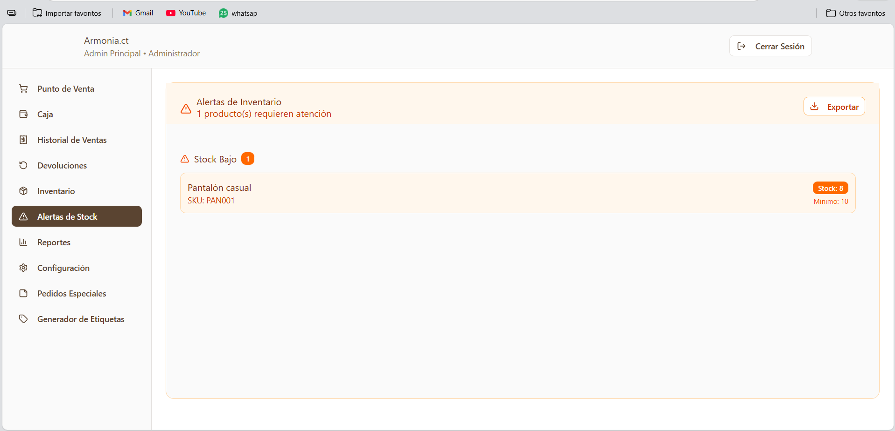
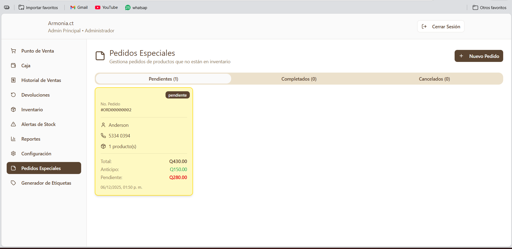
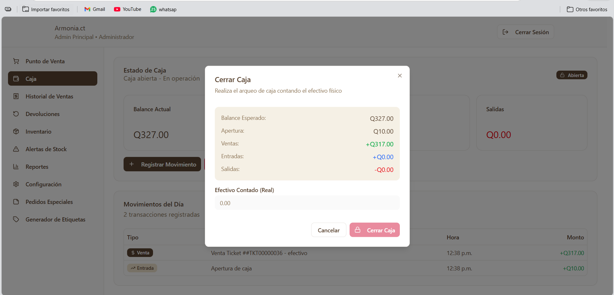

# Armonia — Sistema POS y Gestión de Inventario

Sistema de punto de venta (POS) desarrollado como proyecto real para la gestión de ventas, inventario y caja registradora.  
Incluye backend y frontend completos, diseñados para operar en entornos comerciales reales.

Este repositorio muestra **extractos representativos del sistema**, enfocados en arquitectura, lógica de negocio y buenas prácticas.

---

## Descripción General

Armonia es un sistema POS que cubre el flujo completo de una venta:

- Autenticación de usuarios con roles
- Apertura y cierre de caja
- Registro de ventas y devoluciones
- Gestión avanzada de inventario con variantes
- Reportes y control operativo

El proyecto fue construido con un enfoque práctico y evolutivo, partiendo de un backend monolítico y posteriormente refactorizado en módulos más claros.

---

## Qué incluye este repositorio

Este repositorio **no contiene el código completo del sistema** por tratarse de un proyecto comercial.  
Aquí se incluyen **módulos seleccionados** que representan el núcleo técnico del backend:

- Middleware de autenticación JWT
- Servicio de lógica de caja registradora
- Controlador y servicio de inventario con soporte de variantes
- Manejo de errores PostgreSQL y validaciones de negocio

Estos archivos fueron extraídos y refactorizados para fines de evaluación técnica y portafolio.

---

## Arquitectura del Backend

El backend fue construido con Node.js, Express y PostgreSQL, siguiendo una separación clara de responsabilidades:

Controller (HTTP)
↓
Service (Reglas de negocio)
↓
Database (PostgreSQL)

## Características destacadas:
- Middleware de autenticación y autorización por roles
- Queries SQL parametrizadas
- Manejo explícito de transacciones
- Separación entre capa HTTP y lógica de negocio
- Código escrito en TypeScript con tipado explícito

---

## Funcionalidades principales

### Punto de Venta (POS)
- Carrito interactivo
- Validación de stock en tiempo real
- Registro de ventas y generación de recibos

### Inventario
- CRUD completo de productos
- Manejo de variantes (tallas)
- Cálculo automático de stock total
- Alertas de stock bajo
- Exportación de datos

### Caja Registradora
- Apertura y cierre de caja
- Registro de movimientos
- Cálculo automático de diferencias
- Historial con trazabilidad por usuario

### Seguridad
- Autenticación JWT
- Control de acceso por roles
- Contraseñas con hash bcrypt
- Protección contra SQL Injection

---

## Stack Tecnológico

**Backend**
- Node.js
- Express
- TypeScript
- PostgreSQL

**Frontend**
- React 18
- TypeScript
- Vite
- Tailwind CSS

**Autenticación**
- JWT
- bcrypt

---

## Estado del proyecto

- Proyecto funcional en entorno real
- Código backend refactorizado a capas
- Módulos seleccionados disponibles para revisión técnica

El código completo puede ser compartido de forma privada para procesos de reclutamiento.

---

## Imágenes del Sistema

<table>
	<tr>
		<td>
			<figure>
				
				<figcaption>Login</figcaption>
			</figure>
		</td>
		<td>
			<figure>
				
				<figcaption>Dashboard</figcaption>
			</figure>
		</td>
		<td>
			<figure>
				
				<figcaption>Inventario</figcaption>
			</figure>
		</td>
	</tr>
	<tr>
		<td>
			<figure>
				
				<figcaption>Caja</figcaption>
			</figure>
		</td>
		<td>
			<figure>
				
				<figcaption>Cerrar caja</figcaption>
			</figure>
		</td>
		<td>
			<figure>
				
				<figcaption>Historial de ventas</figcaption>
			</figure>
		</td>
	</tr>
	<tr>
		<td>
			<figure>
				
				<figcaption>Devoluciones</figcaption>
			</figure>
		</td>
		<td>
			<figure>
				
				<figcaption>Reportes</figcaption>
			</figure>
		</td>
		<td>
			<figure>
				
				<figcaption>Generador de etiquetas</figcaption>
			</figure>
		</td>
	</tr>
</table>

### Extras

<table>
	<tr>
		<td>
			<figure>
				
				<figcaption>Alerta de stock</figcaption>
			</figure>
		</td>
		<td>
			<figure>
				
				<figcaption>Configuración</figcaption>
			</figure>
		</td>
		<td>
			<figure>
				
				<figcaption>Pedidos especiales</figcaption>
			</figure>
		</td>
	</tr>
	<tr>
		<td>
			<figure>
				
				<figcaption>Cerrar caja (proceso)</figcaption>
			</figure>
		</td>
		<td></td>
		<td></td>
	</tr>
</table>

---

## Autor

Anderson Aguirre  
Desarrollador Full-Stack Junior (Android + Web)

Contacto:
- Email: andersonaguirre794@gmail.com
- GitHub: https://github.com/imanderrrrr